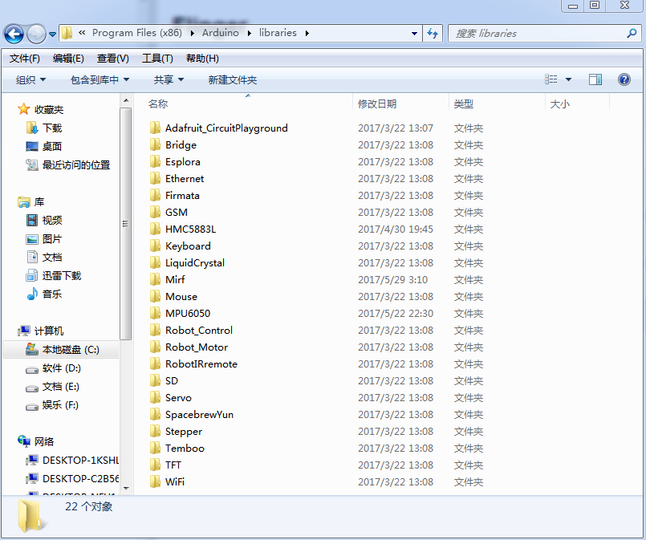
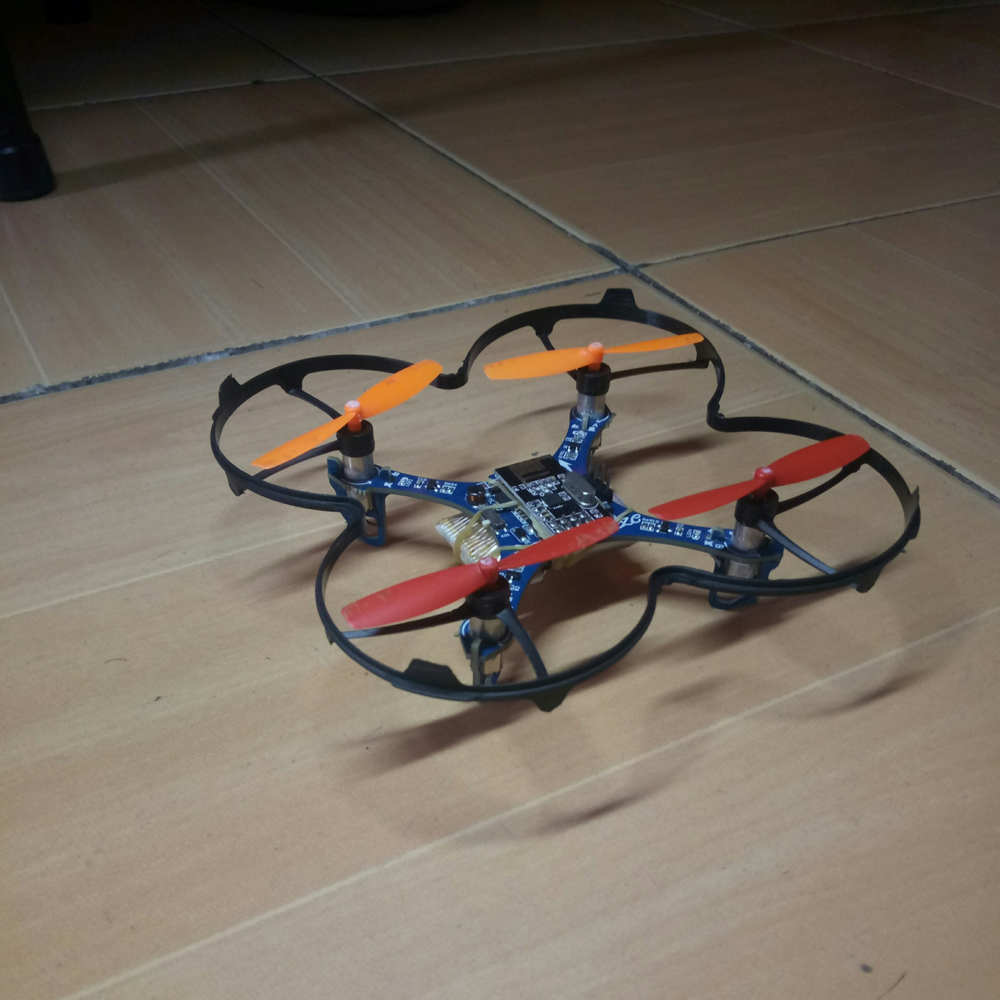
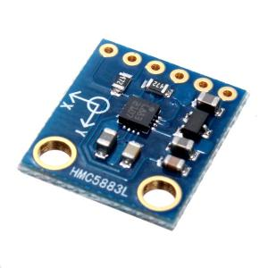
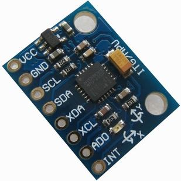
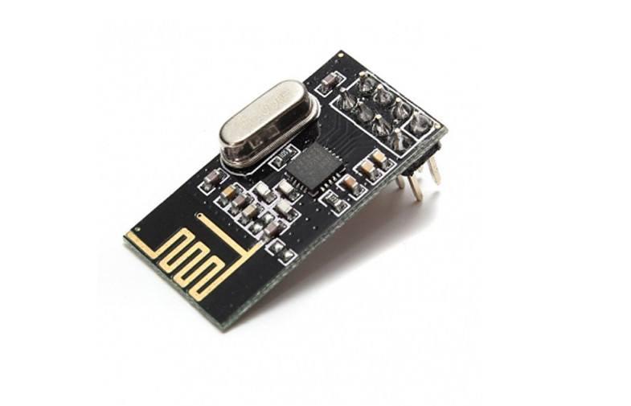
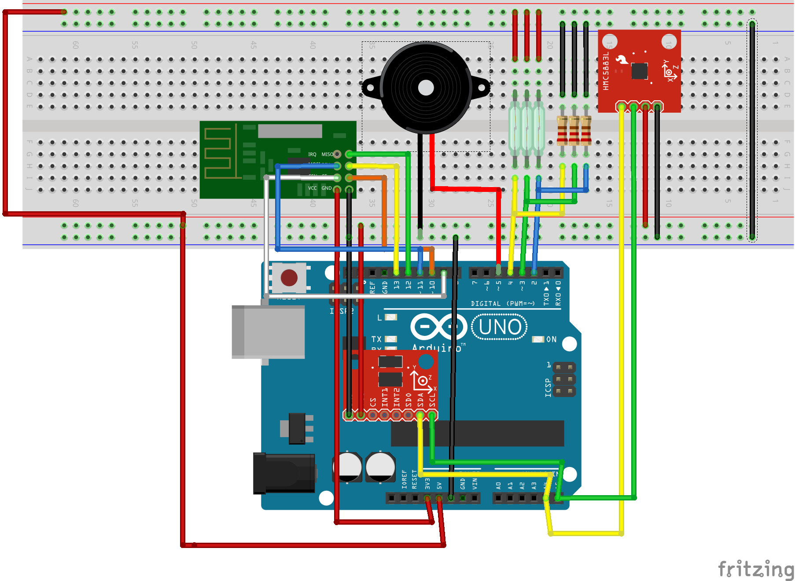
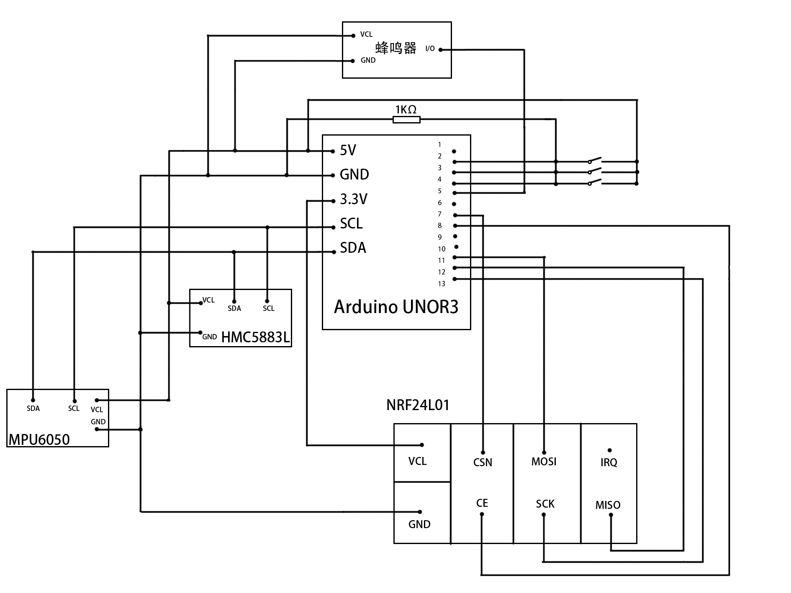
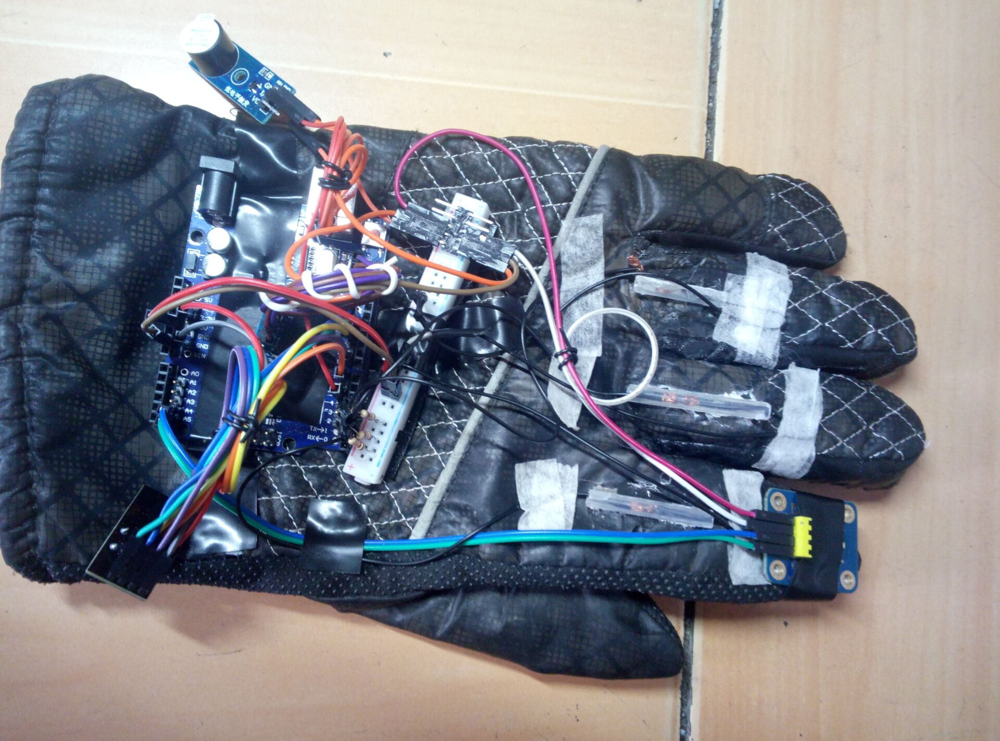

<<<<<<< HEAD
=======
# flinger
Using your fingers to control your unmanned vehicle.
>>>>>>> origin/master
#Flinger
##
######--control the unmanned vehical with your fingers
###Content
1. Preparations
2. Hardware
3. Program
4. Improvement

##
##1.Preparations
First you should put these libraries 

	Wire.h
	I2Cdev.h
	MPU6050.h
	HMC5883L.h//you can get them from github
into

	C:\Program Files (x86)\Arduino\libraries
Just like this:

Then you can use the functions and variables of the libraies.

Next, make sure you have an Arduino UNO, which is essential to our project.

Finally, you should have an unmanned aerial, you can purchase one online. And we use X138 in this project.

##
##2.Hardware
* HMC5883l

It is an electronic compass, which is used to show the direction your first figer pointing at.

It look like this:

This time we only use 4 of the 6(maybe 5) interfaces, which is:

	SCL SDA VCC GND
We can also notice that the communication protocol is I²C. And the working voltage is 5V.

* MPU6050

An accelerometer and gyroscope. But we only use its accelerometer part, to calculate the depression angle of the palm.

And it looks like this:

Also 4 of the interfaces:

	SCL SDA VCC GND

Remember to ensure that the pins are stably attached to the chips.

* NRF24L01

It is a wireless transceiver module, which uses WIFI protocol. It can send/receive 32 bytes once at most, but we only send 12 in this project.

It looks like this:

But there is something different. It use SCI protocol. See wiring diagram for details.

* Wiring diagram

From the left to the right on the breadboard is NRF24L01, active buzzer, swiches, resistance and HMC5883L.
The chip on the Arduino is MPU6050.  

* Circuit diagram

* Product Map

As you can see, the HMC5883L is attached to the finger tip, the switches are attached to the joint of the finger, and the MPU6050(covered by the wires) is on the palm back.

##3.Program
Here we'll talk about some of the functions.

* Read status

This function is used to get the status of the three switches, and return a character to show the combination of the switches. 

    char readSta(void)
When the first finger bents, and the middle bents, it will return 0.

When the first finger straights, and the middle bents, it'll return 1.

When both of them straights, it'll return 2.

* Directions

We use 4 functions for different directions.

	void front()
	void right()
	void left()
	void back()

While the program is initializing, it will calculate the angle of which the finger is pointing at, and it is named 'init_angle'. When the program call the function, 'readCompass()',  it will calculate the angle between the initial one and the present one. Then if the angle is within the scope of (0°, 30°) or (340°, 360°), it will call the function 'front()', and send some commands to the UAV.

* Accelerate

We use 2 function to control this process:

	float calDep()
	void accelerate(float)

The function 'calDep()' will calculate the depression angle by reading the data of MPU6050. Then 'accelerate()' will send the command to the UAV accordingly.

* Transmissing and receiving

	void sendWifi()
	
This function will send the data(stored in TxBuf[12]) to the UAV and receive a string of data(puting it into RxBuf[12]) at the same time.

##4.Improvement
1. The answer from the UAV is a little bit slow. So we need more powerful tool and better algorithm to improve the sensitivity.
2. The controlling gestures are too monotonous, so we are thinking of more gestures to communicate wwith the UAV.
3. The appearance is still very ugly.
<<<<<<< HEAD
4. Maybe we can make some changes on it and use it to control other appliances, like TV, air conditioner, fan and so on. Sounds cool, isn't it?
=======
4. Maybe we can make some changes and use it to control other appliances, like TV, air conditioner, fan and so on. Sounds cool, isn't it?
>>>>>>> origin/master
